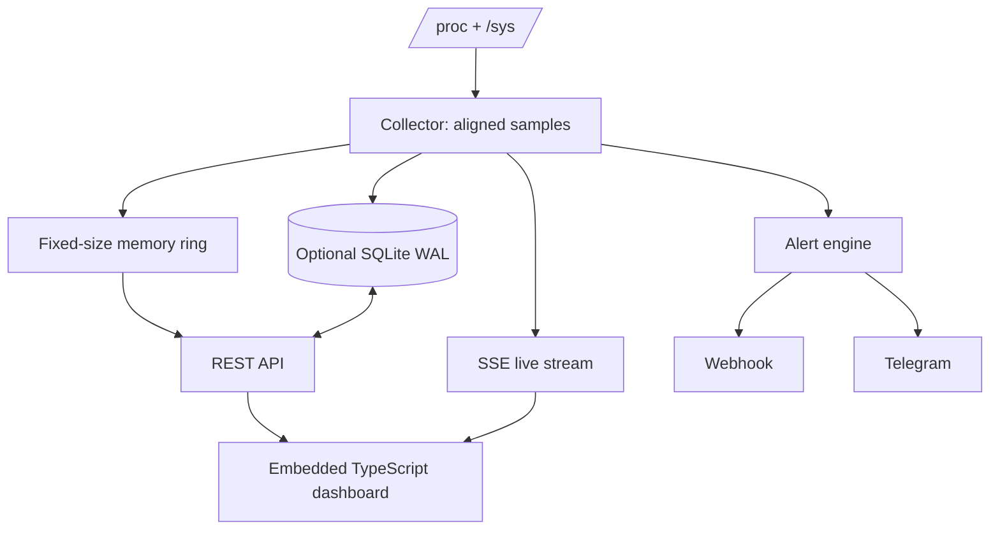

# Server Monitor

A lightweight Linux server monitoring agent with an embedded web dashboard. It runs as a single Go binary, reads metrics directly from `/proc` and `/sys`, keeps a bounded in-memory history by default, streams live samples over SSE, and can optionally persist metrics to SQLite.

## Design goals

1. Minimal resource use.
2. Fast collection and UI updates.
3. Correct delta-based counter metrics.
4. Useful information without a heavy frontend runtime.

The agent does not require root, an external database, Node.js, a cloud service, or a second monitoring daemon. The only outbound traffic is explicitly configured alert delivery.

## Architecture



The collector reads cumulative kernel counters and derives rates from deltas between consecutive samples. The first sample intentionally exposes rate/utilization values as `null` where no previous counter exists.

## Quick start

```bash
cp config.example.toml config.toml
export SERVER_MONITOR_TOKEN='replace-with-a-long-random-token'
make build
./bin/server-monitor --config ./config.toml
```

Open `http://127.0.0.1:9090`, enter the same bearer token, and the dashboard will start streaming. `make build` produces one binary with the dashboard embedded.

## Metrics

- System: hostname, OS, kernel, architecture, CPU model/core count, uptime, boot time.
- CPU: total/per-core utilization from tick deltas, load average 1/5/15, current frequency, thermal-zone temperature when readable.
- Memory: total, used calculated from `MemAvailable`, buffers/cache, swap.
- Filesystems: size/used/free, filesystem type, inode usage.
- Disk I/O: read/write bytes per second and IOPS per device from `/proc/diskstats` deltas.
- Network: per-interface RX/TX bit rate plus packets/errors/drops from `/proc/net/dev` deltas.
- Connections: number of TCP connections in `ESTABLISHED` state.
- Processes: count and top 10 by CPU/RSS with PID, name, RSS and thread count.

Unavailable non-root metrics degrade to absent/empty values instead of terminating the agent.

## Configuration

The single configuration format is TOML. Precedence is CLI flags > environment overrides > TOML > defaults where applicable.

| Setting | Default | Environment override |
|---|---:|---|
| `listen` | `127.0.0.1:9090` | `SERVER_MONITOR_LISTEN` |
| `interval` | `1s` | `SERVER_MONITOR_INTERVAL` |
| `history` | `24h` | `SERVER_MONITOR_HISTORY` |
| `data_dir` | `./data` | `SERVER_MONITOR_DATA_DIR` |
| `auth.token` | required | `SERVER_MONITOR_TOKEN` |
| `persistence.enabled` | `false` | `SERVER_MONITOR_PERSISTENCE` |

Collection interval is validated to `250ms..60s`. The in-memory ring capacity is derived once from `history / interval` and never grows. Prefer the environment variable for the bearer token so it is not committed to disk.

### Persistence

Persistence is disabled by default. When enabled, SQLite uses WAL and `synchronous=NORMAL`; samples are inserted in batches. Hourly compaction keeps raw data for roughly one hour, one sample per minute through seven days, and one sample per five minutes through 90 days. Data older than 90 days is removed.

```toml
[persistence]
enabled = true
path = "./data/metrics.db"
batch_size = 60
```

## Alerts

Four threshold rules are built in: CPU, memory, disk and swap. Each rule has a required duration, hysteresis, and notification cooldown. Alerts automatically resolve after the value drops below `threshold - hysteresis`.

```toml
[alerts.cpu]
threshold = 90
for = "2m"
hysteresis = 5
cooldown = "15m"

[alerts]
webhook_url = "https://example.invalid/monitor"
telegram_bot_token = ""
telegram_chat_id = ""
```

Webhook delivery sends the alert object as JSON. Telegram uses the Bot API `sendMessage` endpoint. Secrets are never logged by the agent.

## HTTP API

All `/api/v1/*` routes require `Authorization: Bearer <token>`. `/healthz` and the static dashboard are intentionally unauthenticated so the UI can load before requesting a token. API responses use JSON with stable snake_case fields.

| Method | Path | Description |
|---|---|---|
| GET | `/healthz` | Liveness and current UTC time. |
| GET | `/api/v1/system` | Static system card plus current uptime. |
| GET | `/api/v1/metrics?from=&to=&step=` | Time-range metrics. `from`/`to` accept Unix seconds or RFC3339. `step` accepts Go duration text such as `5s`/`1m`. |
| GET | `/api/v1/processes` | Latest process count, top CPU and top RAM lists. |
| GET | `/api/v1/alerts` | Alert event history. |
| GET | `/api/v1/ws` | SSE live stream. Event type is `metrics`; comment keepalive every 20 seconds. |

The dashboard uses `fetch()` streaming rather than `EventSource` so the bearer token stays in the `Authorization` header instead of a query string. It reconnects automatically and continues displaying the last cached sample while disconnected.

## Security

- Bearer tokens are SHA-256 hashed in agent memory; plaintext is only used during config load and request hashing.
- Constant-time digest comparison.
- Security headers: CSP, frame denial, MIME sniffing protection, referrer policy.
- Stateless auth and an in-process API rate limit.
- The collector is read-only toward the host. Only the configured data directory is written.
- The provided systemd unit applies `NoNewPrivileges`, `ProtectSystem=strict`, `ProtectHome`, and an explicit writable data directory.

### TLS behind Caddy

```text
monitor.example.com {
    reverse_proxy 127.0.0.1:9090
}
```

### TLS behind nginx

```nginx
server {
    listen 443 ssl http2;
    server_name monitor.example.com;
    ssl_certificate /etc/letsencrypt/live/monitor.example.com/fullchain.pem;
    ssl_certificate_key /etc/letsencrypt/live/monitor.example.com/privkey.pem;
    location / { proxy_pass http://127.0.0.1:9090; proxy_buffering off; }
}
```

Built-in TLS is also available through `[tls] enabled/cert_file/key_file`.

## Docker

```bash
export SERVER_MONITOR_TOKEN='replace-me'
docker compose up --build -d
```

The runtime image is distroless/non-root, the root filesystem is read-only, and only the application data volume is writable.

## systemd

```bash
sudo install -m 0755 bin/server-monitor /usr/local/bin/server-monitor
sudo install -m 0644 deploy/systemd/server-monitor.service /etc/systemd/system/server-monitor.service
sudo systemctl daemon-reload && sudo systemctl enable --now server-monitor
```

Create `/etc/server-monitor/config.toml`, `/etc/server-monitor/env` containing `SERVER_MONITOR_TOKEN=...`, and a `server-monitor` system user with `/var/lib/server-monitor` as its writable data directory.

## Development and tests

```bash
gofmt -w $(find . -name '*.go')
go test ./...
go vet ./...
```

Tests cover counter wrap-around, per-core delta math, ring-buffer overwrite/retention behavior, TOML parsing, alert hysteresis/cooldown behavior, auth, health, and the system API. GitHub Actions also performs a real-process smoke test.

### Resource benchmark

Build first, then run the five-minute benchmark:

```bash
make build
DURATION=300 ./scripts/benchmark.sh ./bin/server-monitor
```

It reports peak RSS and average process CPU measured from `/proc`. The target budgets are `<30 MiB typical RSS` (`50 MiB` hard limit) and `<1.5%` average CPU at the default one-second interval. Benchmark results are machine-dependent, so results should be recorded on the actual target host rather than copied from CI.

## Frontend

`web/src/app.ts` is deliberately dependency-free TypeScript-compatible JavaScript. The build copies it to the embedded `web/dist/app.js`; charts use Canvas directly. This keeps the shipped frontend far below the 250 KB gzip target and avoids a frontend runtime dependency.

## Dependency rationale

- `github.com/pelletier/go-toml/v2`: focused, maintained TOML parser; no telemetry.
- `modernc.org/sqlite`: pure-Go SQLite implementation so `CGO_ENABLED=0` remains possible; no external SQLite shared library or daemon is required.
- Frontend: no runtime dependencies.

All Go module versions are pinned in `go.mod`; module hashes are recorded by Go in `go.sum` when dependencies are resolved.

## Known Linux-specific behavior

The collector currently targets Linux because `/proc`, `/sys`, `statfs`, systemd deployment, and the stated static Linux artifacts are the priority. Containerized deployments expose the container's namespaces/cgroups, so host process/network visibility depends on the container namespace configuration. Docker-container and systemd-unit inventory are intentionally not enabled in the first release because they add socket/DBus permissions and sampling overhead to the default agent.
